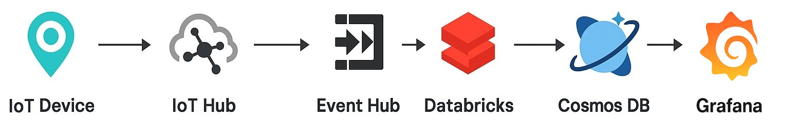

```markdown
# Azure IoT Location Monitoring

This project implements a comprehensive IoT solution for real-time location monitoring using Azure services. It enables the collection, processing, and visualization of location data from IoT devices, providing insights into asset movements and statuses.

## Architecture Overview

The solution follows a streamlined workflow:

1. **IoT Devices**: Collect and transmit location data.
2. **IoT Hub**: Manages device communication and ingests telemetry data.
3. **Event Hub**: Buffers and transports device telemetry messages.
4. **Databricks**: Processes and analyzes the incoming data streams.
5. **Cosmos DB**: Stores processed data for scalable and low-latency access.
6. **Grafana**: Visualizes data through interactive dashboards.

## Data Flow

The solution follows a clear data flow for location telemetry:

`IoT_Device -> IoT_Hub -> Event_Hub -> Databricks -> Cosmos_DB -> Grafana`



## Project Structure

The repository is organized as follows:

```text
azure-iot-location-monitoring/
├── .github/                     # GitHub Actions workflows
│   └── workflows/
│       └── full-deployment.yml  # Main CI/CD pipeline
├── Architecture.jpg               # High-level system architecture diagram
├── azure-creds.json              # Service Principal credentials (IGNORED by Git, used by CI/CD)
├── CONTRIBUTING.md               # Guidelines for external contributors
├── README.md                     # Main project README
├── README_databricks.md          # Supplementary Databricks-specific guidance
├── iot-simulator/                # Source code for the IoT device simulator (Python, Dockerfile)
│   ├── device_simulator.py
│   ├── Dockerfile
│   └── requirements.txt
├── kubernetes/                   # Kubernetes manifests for deploying the simulator to AKS
│   └── simulator-deployment.yaml
└── terraform/                   # Terraform configuration files for Azure infrastructure
    ├── aks.tf                   # AKS cluster definition
    ├── backend.tf               # Remote backend config for shared tfstate across local and CI/CD deployments
    ├── main.tf                  # Core Azure resources (IoT Hub, Event Hub, CosmosDB, ACR)
    ├── modules.tf               # Terraform module definitions (Databricks, Monitoring)
    ├── outputs.tf               # Terraform outputs for deployed resources
    ├── providers.tf             # Terraform provider configurations
    ├── variables.tf             # Terraform input variables
    ├── terraform.tfvars.json    # Local variables file (ignored by Git)
    └── modules/                 
        ├── databricks/           # Databricks cluster and notebook provisioning
        │   ├── main.tf
        │   ├── notebook.py
        │   ├── providers.tf
        │   └── variables.tf
        └── monitoring/           # Monitoring stack: Azure Monitor, Grafana, Alerts
            ├── dashboards/
            ├── main.tf
            ├── outputs.tf
            └── variables.tf
`

## Technologies Used

- **Azure Services:**
    * Azure IoT Hub
    * Azure Event Hubs
    * Azure Databricks
    * Azure Cosmos DB (NoSQL API)
    * Azure Kubernetes Service (AKS)
    * Azure Container Registry (ACR)
    * Azure Log Analytics Workspace
    * Azure Managed Grafana
    * Azure Active Directory (Microsoft Entra ID)

- **Tools & Frameworks:**
    * **Terraform:** For infrastructure provisioning.
    * **GitHub Actions:** For CI/CD automation.
    * **Docker:** For containerizing the IoT simulator.
    * **Python:** For the IoT device simulator and Databricks notebook.
    * **kubectl:** For Kubernetes cluster interaction.
    * **Azure CLI:** For Azure authentication and management.
    * **jq:** For JSON parsing in scripts.

## Setup and Deployment

### Prerequisites

Before deploying this solution, ensure you have the following:

- **Azure Subscription**: Ensure you have an active Azure subscription.
- **Azure CLI:** Installed and configured (`az login`).
- **Terraform CLI:** Version `>= 1.4.0` installed.
- **GitHub Account:** With a personal access token (PAT) to perform `gh` CLI commands.
- **Git:** Installed.
- **Terraform**: Install Terraform to manage infrastructure.
- **Docker**: Required for containerizing the IoT simulator.
- **Kubernetes Cluster**: Set up a Kubernetes cluster for deploying the simulator.
- **jq:** A lightweight and flexible command-line JSON processor.

## Deployment Guide

The deployment is primarily automated via GitHub Actions. However, some initial setup is required.

### 1\. Clone the Repository

Clone this repository to your local machine:

```bash
git clone https://github.com/garymichaelbass/azure-iot-location-pipeline.git
cd azure-iot-location-pipeline
```

### 2\. Azure Service Principal Setup

Your GitHub Actions workflow will use an Azure Service Principal (SP) to authenticate and deploy resources.

Create a Service Principal with Contributor role at the subscription level (for initial setup simplicity; *for production, refine permissions to least privilege after deployment*):

```bash
az ad sp create-for-rbac --name "github-iot-acr-pusher" --role contributor --scopes /subscriptions/<YOUR_AZURE_SUBSCRIPTION_ID> --sdk-auth > azure-creds.json
```

**Important:** The `azure-creds.json` file contains sensitive credentials. **Do NOT commit this file to your Git repository.** It's already in `.gitignore`.

### 3\. GitHub Secrets Configuration

Your GitHub Actions workflow requires the Service Principal credentials to be stored as a GitHub Secret.

1.  Go to your GitHub repository: `https://github.com/garymichaelbass/azure-iot-location-pipeline`
2.  Navigate to **`Settings` \> `Secrets and variables` \> `Actions`**.
3.  Click **`New repository secret`**.
4.  Name the secret: `AZURE_CREDENTIALS`
5.  For the Value: **Copy the entire content of your `azure-creds.json` file** (including the curly braces `{...}`) and paste it here.
6.  Click **`Add secret`**.

### 4\. Terraform Configuration (`terraform.tfvars.json`)

Customize your Azure resource names and locations by creating a `terraform.tfvars.json` file in the `terraform/` directory. This file is ignored by Git, so it's safe for local values. Feel free to use the `terraform/terraform.tfvars.json.template` as a reference.

Create `terraform/terraform.tfvars.json`:

```json
{
  "resource_group_name": "iot-location-rg-<YOUR_UNIQUE_SUFFIX>",
  "location": "eastus2", # Or your preferred Azure region
  "iot_hub_name": "iotlocationhub-<YOUR_UNIQUE_SUFFIX>",
  "iot_device_name": "truck-001",
  "cosmos_db_name": "iotcosmosdb-<YOUR_UNIQUE_SUFFIX>",
  "acr_name": "youracrname<YOUR_UNIQUE_SUFFIX>",
  "aks_node_count": 3,
  "aks_node_vm_size": "Standard_DS2_v2",
  "prefix": "iot",
  "environment": "dev",
  "project": "iot-simulator",
  "owner": "your-name",
  "github_client_id": "<YOUR_SERVICE_PRINCIPAL_CLIENT_ID>" # The 'clientId' from azure-creds.json
}
```

**Remember to replace all placeholders `<YOUR_UNIQUE_SUFFIX>`, `<YOUR_AZURE_SUBSCRIPTION_ID>`, and `<YOUR_SERVICE_PRINCIPAL_CLIENT_ID>` with your actual values.**

### 5\. Initial Terraform Apply (Local - Optional but Recommended)

It's often a good idea to perform an initial `terraform apply` locally to ensure all providers are correctly configured and to handle any one-time issues (like importing existing resources or the two-phase Databricks deployment).

- **Important for Databricks:** If this is the *very first* time deploying, the `terraform apply` might fail when it tries to create Databricks cluster/notebook/job resources. This is because the Databricks provider needs the Databricks Workspace URL (which isn't known until the `azurerm_databricks_workspace` is fully deployed). If it fails, simply run `terraform apply -auto-approve` **again**. The second run should succeed.

- **For AKS Extensions/Resource Providers:** Ensure you have registered the necessary resource providers if prompted (e.g., `az provider register --namespace Microsoft.ContainerService`, `az provider register --namespace Microsoft.Dashboard`).

### Deployment Steps

1. **Provision Infrastructure**:
   - Navigate to the `terraform/` directory.
   - Initialize Terraform:
     ```bash
     terraform init
     ```
   - Apply the Terraform configuration:
     ```bash
     terraform apply
     ```
   - This will create the necessary Azure resources, including IoT Hub, Event Hub, Databricks workspace, Cosmos DB, and Grafana.

2. **Deploy IoT Simulator**:
   - Build the Docker image:
     ```bash
     docker build -t iot-simulator .
     ```
   - Deploy the simulator to your Kubernetes cluster using the provided `simulator-deployment.yaml`.

3. **Configure Databricks**:
   - Refer to `README_databricks.md` for detailed instructions on setting up Databricks to process and analyze the data.

4. **Set Up Grafana Dashboards**:
   - Access Grafana through the Azure portal.
   - Import the provided dashboards to visualize the telemetry data.


## Usage

Once the infrastructure is deployed and the simulator is running, the system will:

- Simulate IoT devices sending location data.
- Ingest data into IoT Hub, which routes it to Event Hub.
- Databricks processes the data, storing results in Cosmos DB.
- Grafana provides real-time dashboards for monitoring and analysis.


## Cleaning Up Resources

To destroy all deployed Azure resources (and avoid incurring further costs):

1.  From your `terraform/` directory:
    ```bash
    cd terraform/
    terraform destroy -auto-approve
    ```
    This command will remove all resources managed by your Terraform configuration.

## Contributing

Contributions are welcomed to enhance this project. Please refer to the [CONTRIBUTING.md](./CONTRIBUTING.md) for guidelines.

## License

This project is licensed under the MIT License.

## Acknowledgments

- [Azure IoT Reference Architecture 2.1 release](https://azure.microsoft.com/en-us/blog/azure-iot-reference-architecture-2-1-release/)
- [Azure IoT Central solution architecture](https://learn.microsoft.com/en-us/azure/iot-central/core/concepts-architecture)
- [Real-time asset tracking and management using IoT Central](https://learn.microsoft.com/en-us/azure/architecture/solution-ideas/articles/real-time-asset-tracking-mgmt-iot-central)

For more information on Azure IoT solutions, refer to the [Azure IoT Reference Architecture](https://azure.microsoft.com/en-us/blog/azure-iot-reference-architecture-2-1-release/).
```
